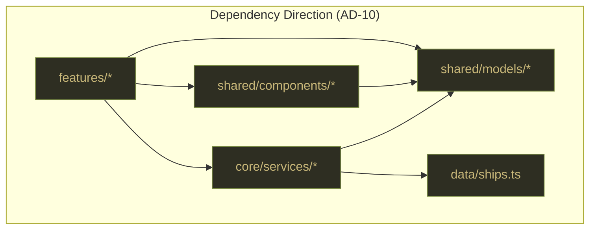
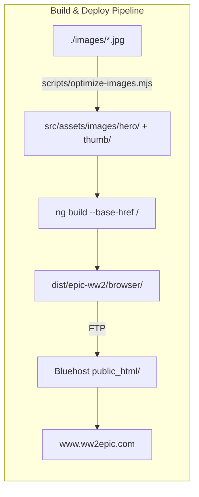

# Architecture Spine — Howard Hertzog WWII Ship Photography Website

## Design Paradigm

**Data-Driven Component Presentation SPA.** A single Angular 22 component template set renders all 21 ship pages from one typed data file. No server-side boundary exists at runtime; there are no HTTP API calls. The entire site is a static SPA: `ng build` produces a `dist/` tree that is FTP-uploaded to Bluehost and served as static files.

Layers mapped to directories:

| Layer | Directory | Responsibility |
|---|---|---|
| Data | `src/data/` | Typed ship roster; the one source of truth |
| Models | `src/app/shared/models/` | TypeScript interfaces; no logic |
| Services | `src/app/core/services/` | Data access and ship lookup; no HTTP |
| Shared components | `src/app/shared/components/` | Reusable UI blocks; no route knowledge |
| Feature components | `src/app/features/` | Route-level pages; compose shared components |
| Core layout | `src/app/core/components/` | PersistentNav; app shell |
| Styles | `src/styles/` | Global tokens, typography, reset |
| Assets | `src/assets/images/` | Optimized WebP + JPEG images |
| Image pipeline | `scripts/` | Pre-build Node.js optimization script |

## Invariants & Rules

### AD-1 — Standalone Angular components; no NgModules

- **Binds:** every Angular component, directive, and pipe in the project
- **Prevents:** NgModule-based bootstrap, module-scoped providers, `declarations` arrays
- **Rule:** All components use `standalone: true`. App is bootstrapped via `bootstrapApplication()`. Shared components are imported directly into the consuming component's `imports` array.

### AD-2 — HashLocationStrategy; no PathLocationStrategy

- **Binds:** Angular Router configuration in `app.config.ts` (`FR-28`) **[ADOPTED]**
- **Prevents:** route paths that require server-side URL rewriting to serve `index.html`
- **Rule:** Router is configured with `withHashLocation()`. All internal route links use Angular `routerLink`; no `<a href>` pointing to bare paths. URL pattern is `/#/ships/:slug`, `/#/about`, etc.

### AD-3 — `src/data/ships.ts` is the sole source of truth for ship data

- **Binds:** `ShipDataService`, routing, fleet ordering, homepage hero designation (`FR-30`) **[ADOPTED]**
- **Prevents:** data hard-coded in templates, per-component data declarations, JSON files, duplicate ship records
- **Rule:** The `SHIPS` array in `ships.ts` is the only place ship metadata lives. Fleet order, Prev/Next sequence, and the `isHomepageHero` flag are all determined by array position and properties in this file. `ShipDataService` reads this array; no component imports `ships.ts` directly.

### AD-4 — DESIGN.md tokens expressed as CSS custom properties in `_tokens.scss`

- **Binds:** all component SCSS files
- **Prevents:** hard-coded hex values, per-component color redefinitions, token drift from DESIGN.md
- **Rule:** Every color, font-family, spacing constant, and z-index used by a component must be a reference to a CSS custom property defined in `src/styles/_tokens.scss`. Direct hex values in component files are a build-time violation. Token names follow `--color-{name}`, `--font-{role}`, `--space-{size}`.

### AD-5 — `WitnessTrioBlock` is an atomic component; never render its children independently on a ship page

- **Binds:** `ShipPageComponent` **[ADOPTED from UX EXPERIENCE.md]**
- **Prevents:** partial rendering (e.g. a ship page with `DossierCard` but no `NarrativeSection`)
- **Rule:** `ShipPageComponent` renders exactly one `<app-witness-trio-block>`. `WitnessTrioBlock` renders `DossierCard`, `AttributionCaption`, and `NarrativeSection` unconditionally. If any data field required by those children is absent, `WitnessTrioBlock` renders a visible "Content pending" placeholder for that element — never an empty or missing block. `DossierCard`, `AttributionCaption`, and `NarrativeSection` are not used outside `WitnessTrioBlock`.

### AD-6 — Offline image pipeline produces `hero/` and `thumb/` variants; `<picture>` element delivers WebP with JPEG fallback

- **Binds:** image management (`FR-24`, `FR-25`), `ShipHero` component, `FleetGrid` component, `HomepageHero` component
- **Prevents:** raw JPEG delivery without WebP, single-resolution images, missing `<picture>` fallback
- **Rule:** Run `node scripts/optimize-images.mjs` before the first build and whenever source images change. It reads `./images/*.jpg`, writes to `src/assets/images/hero/{slug}.webp`, `src/assets/images/hero/{slug}.jpg`, `src/assets/images/thumb/{slug}.webp`, `src/assets/images/thumb/{slug}.jpg`. `ShipHero` and `HomepageHero` use hero variants; `FleetGrid` uses thumb variants. All image elements use `<picture>` with `<source type="image/webp">` and `` JPEG fallback.

### AD-7 — `ShipDataService` is a root-scope singleton; never provided at component level

- **Binds:** `ShipDataService` and all injectors
- **Prevents:** multiple instances of the service, inconsistent fleet ordering across components
- **Rule:** `ShipDataService` is decorated `@Injectable({ providedIn: 'root' })`. It is never listed in a component's `providers` array. It exposes three methods: `getAll(): Ship[]`, `getBySlug(slug: string): Ship | undefined`, `getAdjacentSlugs(slug: string): { prev: string; next: string }`.

### AD-8 — Deploy from `dist/epic-ww2/browser/`; FTP contents to Bluehost `public_html/` root

- **Binds:** build and deployment workflow (`FR-29`, `FR-32`)
- **Prevents:** deploying from project root, deploying a nested path that breaks root-relative asset references
- **Rule:** `ng build --base-href /` writes output to `dist/epic-ww2/browser/`. FTP all contents of that directory (not the directory itself) to Bluehost `public_html/`. The `index.html` must land at `public_html/index.html`.

### AD-9 — Custom `TitleStrategy` sets `<title>` per route from ship name or route label

- **Binds:** Angular Router, `app.config.ts` providers (`FR` implied by EXPERIENCE.md accessibility floor)
- **Prevents:** static `"epic-ww2"` title on all pages; prevents screen readers and browser tabs from showing meaningless titles
- **Rule:** A `RouterTitleStrategy` extending Angular's `TitleStrategy` is provided in `app.config.ts`. Ship page title: `"{Ship Name} — Howard Hertzog WWII Photography"`. Homepage: `"Fleet — Howard Hertzog WWII Photography"`. About: `"About Howard — Howard Hertzog WWII Photography"`.

### AD-10 — Dependency direction

- **Binds:** all imports across the codebase
- **Prevents:** circular dependencies, shared components gaining route knowledge, services depending on feature components
- **Rule:** Permitted import directions:
  - `features/*` → `shared/components/*`, `shared/models/*`, `core/services/*`
  - `shared/components/*` → `shared/models/*`
  - `core/services/*` → `src/data/ships.ts`, `shared/models/*`
  - **Forbidden:** `shared/*` → `features/*` | `core/services/*` → `features/*` | `src/data/*` → anywhere in `src/app/`

## Consistency Conventions

| Concern | Convention |
|---|---|
| File naming | kebab-case for all files; component files: `{name}.component.ts\|html\|scss` |
| Class naming | PascalCase; selector prefix `app-` on all components |
| Ship slug | Filename base of source image minus extension (e.g. `uss-valley-forge`). Slugs are the binding key between `ships.ts`, routing, and asset filenames. |
| TypeScript paths | `@app/*` alias → `src/app/*`; `@data/*` → `src/data/*`; `@assets/*` → `src/assets/*`; configured in `tsconfig.json` |
| CSS token names | `--color-{semantic}`, `--font-{role}`, `--space-{size}`, `--z-{layer}` |
| Alt text | Ship hero: `"{Name}, photographed by Howard Hertzog, San Francisco Bay, c. 1944–1946"`. Fleet thumb: `"{Name} — thumbnail"` |
| `Ship` interface | Single `Ship` interface in `src/app/shared/models/ship.model.ts`; all components import from here |
| Paragraph data | `narrative` field in `Ship` is `string[]` (array of paragraph strings, each rendered as `<p>`) |
| Unknown dossier values | Store as `"Not confirmed"` string in data; `DossierCard` renders it in muted color |
| `isHomepageHero` | Exactly one ship in `SHIPS` array has `isHomepageHero: true`; `HomeComponent` queries `getAll().find(s => s.isHomepageHero)` |

## Stack

| Name | Version |
|---|---|
| Angular | ^22.1.0 |
| Angular CLI | ^22.1.0 |
| TypeScript | ~5.8 `[ASSUMPTION]` |
| Node.js (dev toolchain) | 22.x LTS |
| SCSS | bundled with Angular CLI |
| sharp (image pipeline) | ^0.33.0 |

## Structural Seed

```text
{project-root}/
  images/                          # Source JPEGs from Howard's collection (input only)
  scripts/
    optimize-images.mjs            # Pre-build: JPEG → WebP, resize hero+thumb variants
  src/
    app/
      core/
        components/
          persistent-nav/          # PersistentNav standalone component
        services/
          ship-data.service.ts     # Root-scope; getAll(), getBySlug(), getAdjacentSlugs()
        title-strategy.ts          # Custom TitleStrategy for per-route <title>
      features/
        home/
          home.component.ts|html|scss       # HomepageHero + intro + FleetGrid
        ship/
          ship-page.component.ts|html|scss  # ShipHero + WitnessTrioBlock + ShipNav
        about/
          about.component.ts|html|scss      # ComingSoon
        not-found/
          not-found.component.ts|html|scss  # NotFound
      shared/
        components/
          witness-trio-block/      # Atomic: DossierCard + AttributionCaption + NarrativeSection
          dossier-card/
          attribution-caption/
          narrative-section/
          ship-hero/               # <picture> hero; blur-up placeholder
          fleet-grid/              # 21-thumbnail grid
          ship-nav/                # Prev/Next + Back to fleet; arrow-key listener
          coming-soon/             # Reused by About and NotFound
        models/
          ship.model.ts            # Ship interface
      app.component.ts|html        # <router-outlet> shell
      app.routes.ts                # Route definitions
      app.config.ts                # bootstrapApplication providers
    data/
      ships.ts                     # SHIPS: Ship[] — 21 entries, canonical order
    styles/
      _tokens.scss                 # CSS custom properties from DESIGN.md
      _typography.scss             # @font-face / Google Fonts link helpers
      _reset.scss                  # Minimal reset
      styles.scss                  # Imports above; grain pseudo-element on body::after
    assets/
      images/
        hero/                      # {slug}.webp + {slug}.jpg (1920w, ≤200KB)
        thumb/                     # {slug}.webp + {slug}.jpg (600w, thumbnail)
    index.html                     # Google Fonts <link>; base tag
    main.ts                        # bootstrapApplication(AppComponent, appConfig)
  angular.json
  package.json
  tsconfig.json
```





## Capability → Architecture Map

| Capability / FR | Lives in | Governed by |
|---|---|---|
| Ship page template (FR-1–8) | `features/ship/`, `shared/components/witness-trio-block/`, `ship-hero/`, `ship-nav/` | AD-3, AD-5, AD-6 |
| Homepage + fleet grid (FR-9–11) | `features/home/`, `shared/components/fleet-grid/` | AD-3, AD-6 |
| Navigation (FR-12–15) | `core/components/persistent-nav/`, `shared/components/ship-nav/`, `features/about/` | AD-2, AD-9 |
| Visual design system (FR-16–19) | `src/styles/_tokens.scss`, all component SCSS | AD-4 |
| Content / dossier data (FR-20–23) | `src/data/ships.ts` | AD-3 |
| Image management (FR-24–26) | `scripts/optimize-images.mjs`, `src/assets/images/`, `shared/components/ship-hero/`, `fleet-grid/` | AD-6 |
| Angular platform (FR-27–32) | `app.config.ts`, `app.routes.ts`, `angular.json` | AD-1, AD-2, AD-7, AD-8, AD-9 |
| NFR-1 Performance | AD-6 (image optimization), `ShipHero` blur-up placeholder | AD-6 |
| NFR-2 Accessibility | alt text convention, `TitleStrategy`, focus styles in `_tokens.scss` | AD-9, conventions |
| NFR-3 Extensibility | `ships.ts` data-driven routing, single template | AD-3, AD-5 |
| NFR-4 Hosting compat | HashLocationStrategy, `--base-href /` | AD-2, AD-8 |

## Deferred

| Item | Reason deferred |
|---|---|
| `Ship` interface narrative field format (string vs. string[]) | Decided as `string[]` (AD-3 convention); implementation detail owned by story |
| `ng build` `outputPath` value in `angular.json` | Set by CLI at project init; `dist/epic-ww2/browser/` is the Angular 22 default, verify at init |
| Exact sharp resize dimensions and quality settings | Owned by image management story; ≤200KB target (FR-25) is the constraint |
| Arrow-key listener scope (document vs. host element) | Implementation detail for `ShipNav` story; document-level is the EXPERIENCE.md call |
| Google Fonts self-hosting vs. CDN | CDN (`<link>` in `index.html`) assumed; self-hosting is a swap with no architectural impact |
| `.ftpignore` / deploy script automation | Deployment tooling is operational; no architectural constraint beyond AD-8 |
