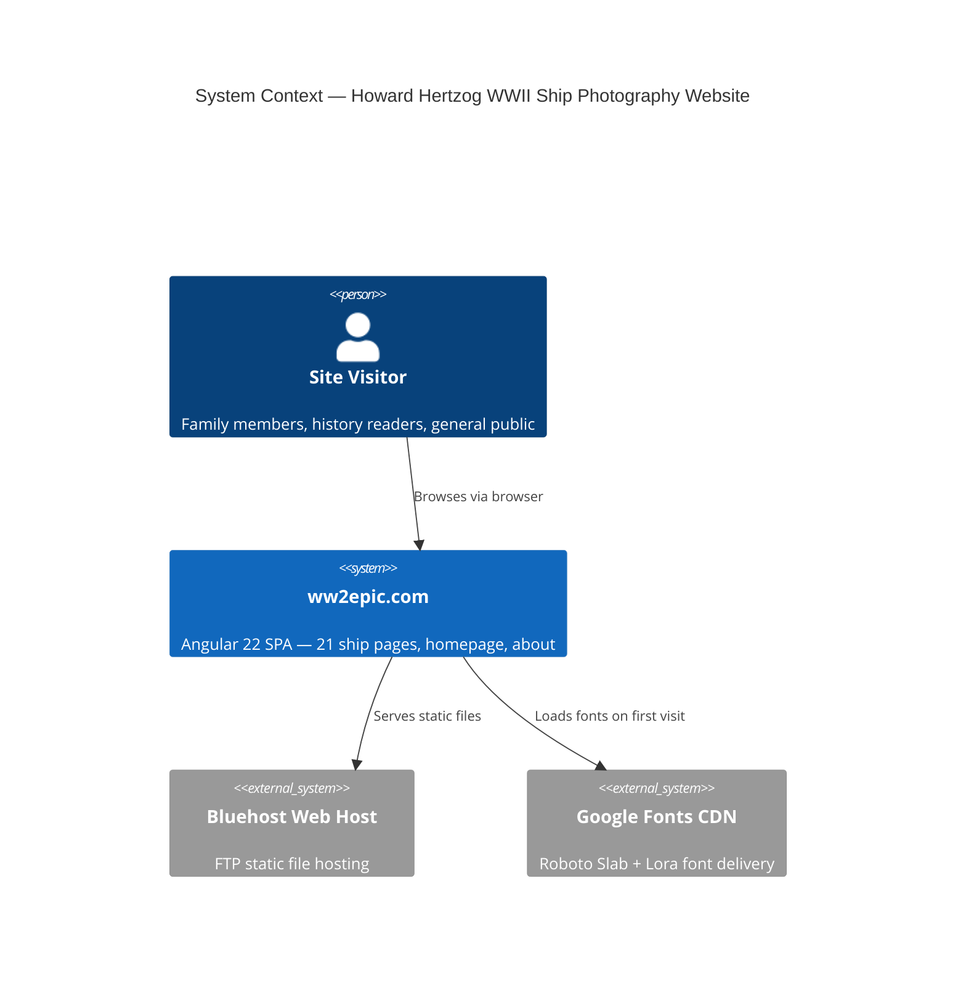
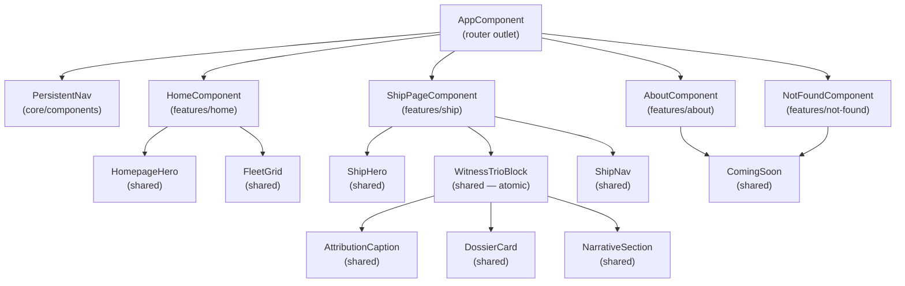

# Architecture Document — Howard Hertzog WWII Ship Photography Website

*Fuller explainer for implementation context. The spine (`ARCHITECTURE-SPINE.md`) is the build contract — this document is the walkthrough.*

---

## System Overview

The site is a static Angular 22 SPA with no server-side backend. All runtime data lives in one TypeScript file (`ships.ts`). The Angular CLI builds the site to a `dist/` folder that is FTP-uploaded to Bluehost and served as static files at `www.ww2epic.com`.



There are no database calls, no authentication, no API endpoints, and no server-side rendering. Angular's `HashLocationStrategy` means the Bluehost server only ever serves `index.html` — all routing is handled in the browser.

---

## Component Architecture



All components are standalone (AD-1). No component renders `DossierCard`, `AttributionCaption`, or `NarrativeSection` outside `WitnessTrioBlock` (AD-5). `ShipDataService` is the only access point to `ships.ts` (AD-7).

---

## Data Model

```typescript
// src/app/shared/models/ship.model.ts

export interface Ship {
  slug: string;            // URL segment & asset filename base (e.g. "uss-valley-forge")
  name: string;            // Display name (e.g. "USS Valley Forge")
  vesselClass: string;     // Dossier field — "Essex-class aircraft carrier"
  commissioned: string;    // Dossier field — human-readable date string
  fate: string;            // Dossier field — "Decommissioned 15 January 1970"
  narrative: string[];     // Array of paragraph strings for NarrativeSection
  sources: string[];       // Citation strings for historical caveat display
  altText: string;         // Full alt text string per EXPERIENCE.md convention
  isHomepageHero?: boolean; // Exactly one ship sets this true; default undefined
}
```

**`src/data/ships.ts`** exports a single `SHIPS: Ship[]` array of 21 entries. The array order defines fleet browsing order (Prev/Next, fleet grid display sequence). Changing the order is the only mechanism for resequencing the fleet — no separate ordering field exists.

The 21 ships (slugs derived from `./images/` filenames):

| # | Slug | Display Name |
|---|---|---|
| 1 | `burton-island-ag-88` | Burton Island (AG-88) |
| 2 | `dms-doran` | DMS Doran |
| 3 | `general-hersey` | General Hersey |
| 4 | `general-hw-butler` | General H.W. Butler |
| 5 | `lsm-276` | LSM-276 |
| 6 | `tug-181` | Tug 181 |
| 7 | `uss-allen-m-sumner` | USS Allen M. Sumner |
| 8 | `uss-atlanta` | USS Atlanta |
| 9 | `uss-benham` | USS Benham |
| 10 | `uss-caiman` | USS Caiman |
| 11 | `uss-chipola` | USS Chipola |
| 12 | `uss-columbus` | USS Columbus |
| 13 | `uss-haven` | USS Haven |
| 14 | `uss-keppler` | USS Keppler |
| 15 | `uss-massachusettes` | USS Massachusetts |
| 16 | `uss-oklahoma-city` | USS Oklahoma City |
| 17 | `uss-rockwall` | USS Rockwall |
| 18 | `uss-rodgers` | USS Rodgers |
| 19 | `uss-theodore-e-chandler` | USS Theodore E. Chandler |
| 20 | `uss-valley-forge` | USS Valley Forge |
| 21 | `uss-vicksburg` | USS Vicksburg |

> **Note:** Two source image filename anomalies carry through to slugs: `uss-keppler-` (trailing dash — strip it in `ships.ts`) and `uss-massachusettes` (misspelling — use the misspelled slug to match the image file; the `name` field shows the correct spelling "USS Massachusetts").

---

## Routing

```typescript
// src/app/app.routes.ts
export const routes: Routes = [
  {
    path: '',
    component: HomeComponent,
    title: 'Fleet — Howard Hertzog WWII Photography'
  },
  {
    path: 'ships/:slug',
    component: ShipPageComponent
    // Title set dynamically by RouterTitleStrategy from ship.name
  },
  {
    path: 'about',
    component: AboutComponent,
    title: 'About Howard — Howard Hertzog WWII Photography'
  },
  {
    path: 'not-found',
    component: NotFoundComponent,
    title: 'Not Found — Howard Hertzog WWII Photography'
  },
  { path: '**', redirectTo: 'not-found' }
];
```

```typescript
// src/app/app.config.ts
export const appConfig: ApplicationConfig = {
  providers: [
    provideRouter(
      routes,
      withHashLocation(),          // AD-2: HashLocationStrategy
      withComponentInputBinding(), // bind :slug to @Input() slug in ShipPageComponent
      withRouterConfig({ scrollPositionRestoration: 'top' })
    ),
    { provide: TitleStrategy, useClass: RouterTitleStrategy }  // AD-9
  ]
};
```

`ShipPageComponent` receives `slug` as an input via `withComponentInputBinding()` — no need to inject `ActivatedRoute` for the slug parameter.

---

## ShipDataService

```typescript
// src/app/core/services/ship-data.service.ts

@Injectable({ providedIn: 'root' })  // AD-7: root singleton
export class ShipDataService {
  private ships = SHIPS;  // imported from src/data/ships.ts

  getAll(): Ship[] {
    return this.ships;
  }

  getBySlug(slug: string): Ship | undefined {
    return this.ships.find(s => s.slug === slug);
  }

  getAdjacentSlugs(slug: string): { prev: string; next: string } {
    const idx = this.ships.findIndex(s => s.slug === slug);
    const len = this.ships.length;
    return {
      prev: this.ships[(idx - 1 + len) % len].slug,  // circular
      next: this.ships[(idx + 1) % len].slug           // circular
    };
  }
}
```

---

## Image Pipeline

The original images in `./images/` are source-only — they are never served directly. `scripts/optimize-images.mjs` processes them before the first Angular build and whenever they change.

```
Input:  ./images/{slug}.jpg
Output: src/assets/images/hero/{slug}.webp    (resize to 1920w, WebP ≤200KB)
        src/assets/images/hero/{slug}.jpg     (resize to 1920w, JPEG fallback)
        src/assets/images/thumb/{slug}.webp   (resize to 600w, WebP)
        src/assets/images/thumb/{slug}.jpg    (resize to 600w, JPEG fallback)
```

Script uses `sharp` (`^0.33.0`). Run once: `node scripts/optimize-images.mjs`.

**`ShipHero` template pattern:**

```html
<figure class="ship-hero">
  <picture>
    <source type="image/webp" [srcset]="'assets/images/hero/' + ship.slug + '.webp'">
    
  </picture>
  <figcaption class="ship-hero__name">{{ ship.name }}</figcaption>
</figure>
```

**`FleetGrid` thumbnail pattern:**
```html
<picture>
  <source type="image/webp" [srcset]="'assets/images/thumb/' + ship.slug + '.webp'">
  
</picture>
```

Hero image uses `loading="eager"` (above the fold, critical to first paint). All fleet grid thumbnails use `loading="lazy"`.

---

## Design Token System

`src/styles/_tokens.scss` defines all CSS custom properties that map to `DESIGN.md` tokens. Every component SCSS file references only these variables — no hex values directly (AD-4).

```scss
// src/styles/_tokens.scss  (excerpt)
:root {
  // Colors
  --color-bg:              #16160e;
  --color-surface:         #23231a;
  --color-surface-raised:  #2e2e22;
  --color-surface-cont:    #38382c;
  --color-on-surface:      #ede9df;
  --color-khaki:           #c9b87a;   // headings, ship names
  --color-steel:           #8a9aaa;   // secondary text
  --color-steel-muted:     #5a6870;
  --color-olive:           #7a8c44;   // primary accent
  --color-olive-dim:       #4a5228;
  --color-outline:         #4a5a6a;
  --color-outline-v:       #3d3d2e;
  --color-overlay:         rgba(22, 22, 14, 0.82);

  // Typography
  --font-slab: 'Roboto Slab', Georgia, serif;
  --font-lora: 'Lora', Georgia, serif;

  // Spacing
  --space-gutter:       24px;
  --space-gutter-mob:   16px;
  --space-content-max:  880px;
  --space-narrow-max:   660px;
  --space-section-gap:  4rem;
  --space-hero-h:       clamp(400px, 68vh, 680px);

  // Z-index
  --z-nav:     100;
  --z-grain:   9999;
}
```

---

## Build & Deploy

### Build

```bash
# Step 1: Image pipeline (one-time + on image changes)
node scripts/optimize-images.mjs

# Step 2: Angular build
ng build --base-href /
# Output: dist/epic-ww2/browser/
```

### Deploy

FTP the **contents** of `dist/epic-ww2/browser/` to Bluehost `public_html/`. Key files that must land at root:
- `index.html` → `public_html/index.html`
- `main-*.js` → `public_html/main-*.js`
- `styles-*.css` → `public_html/styles-*.css`
- `assets/` → `public_html/assets/`

Do **not** upload the `dist/epic-ww2/browser/` directory itself — upload its contents.

### Adding a new ship in the future

1. Drop source JPEG into `./images/{new-slug}.jpg`
2. Run `node scripts/optimize-images.mjs`
3. Add one `Ship` entry to `SHIPS` array in `src/data/ships.ts`
4. Add nav entry if needed
5. `ng build && FTP`

No Angular code changes, no new components, no routing changes.

---

## `[ASSUMPTION]` Tags

| Tag | Detail |
|---|---|
| TypeScript ~5.8 | Angular 22.1 compat range — confirm with `ng new` output at project init |
| `dist/epic-ww2/browser/` output path | Angular 22 default for project named `epic-ww2`; verify in `angular.json` after `ng new` |
| No SSR / prerendering | SEO not a stated requirement; client-side SPA is sufficient |
| Google Fonts CDN | `<link>` in `index.html`; acceptable for FTP-deployed static site |
| Grain via CSS `body::after` SVG noise | No external texture asset; CSS-only implementation |
